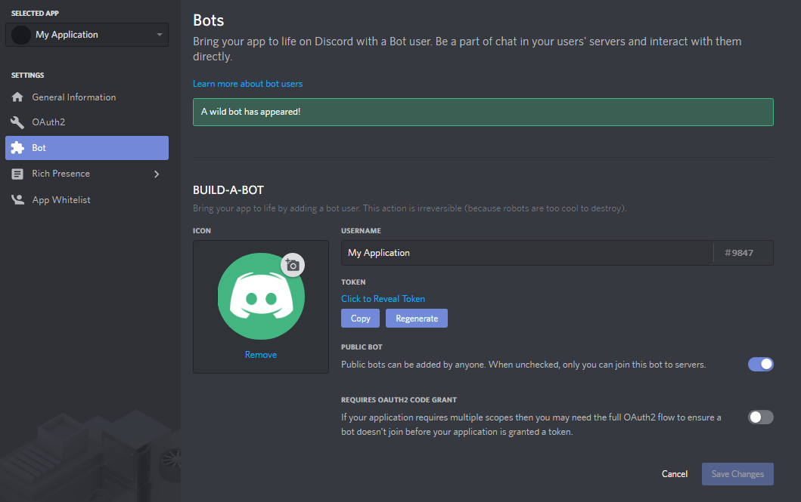

# Text Manipulation

This is a normal text.

---

### Bold Text
```
**Bold text**
__Bold text__
```
**Bold text**
__Bold text__

---

### Italic Text
```
*Italic text*
_Italic text_
```
*Italic text*
_Italic text_

---

### Strikethrough Text
```
~~Strikethrough text~~
```
~~Strikethrough text~~

---

### Masked link
```
[Something](/directory/README.md)

[Paladin Website](https://www.paladinbot.online/)
```
[Something](/README.md)

[Paladin Website](https://www.paladinbot.online/)

---

### Inline Code
```
`npm install`
[`Inline code with a link`](/README.md)
```
`npm install`
[`Inline code with a link`](/README.md)

---

### Item listing
```
+ Create a list by starting a line with `+`, `-`, or `*`
+ Sub-lists are made by indenting 2 spaces:
  - Marker character change forces new list start:
    * Ac tristique libero volutpat at
    + Facilisis in pretium nisl aliquet
    - Nulla volutpat aliquam velit
```
+ Create a list by starting a line with `+`, `-`, or `*`
+ Sub-lists are made by indenting 2 spaces:
  - Marker character change forces new list start:
    * Ac tristique libero volutpat at
    + Facilisis in pretium nisl aliquet
    - Nulla volutpat aliquam velit

---

### Tables
```
## Tables

| Option | Description |
| ------ | ----------- |
| data   | path to data files to supply the data that will be passed into templates. |
| engine | engine to be used for processing templates. Handlebars is the default. |
| ext    | extension to be used for dest files. |

Right aligned columns

| Option | Description |
| ------:| -----------:|
| data   | path to data files to supply the data that will be passed into templates. |
| engine | engine to be used for processing templates. Handlebars is the default. |
| ext    | extension to be used for dest files. |
```

| Option | Description |
| ------ | ----------- |
| data   | path to data files to supply the data that will be passed into templates. |
| engine | engine to be used for processing templates. Handlebars is the default. |
| ext    | extension to be used for dest files. |

Right aligned columns

| Option | Description |
| ------:| -----------:|
| data   | path to data files to supply the data that will be passed into templates. |
| engine | engine to be used for processing templates. Handlebars is the default. |
| ext    | extension to be used for dest files. |

---

## Links
```
[link text](https://dev.nodeca.com)

[link with title](https://nodeca.github.io/pica/demo/ "title text!")
```
[link text](https://dev.nodeca.com)

[link with title](https://nodeca.github.io/pica/demo/ "title text!")


# HEADERS
---
```
# h1

## h2

### h3

#### h4

##### h5

###### h6
```

# h1

## h2

### h3

#### h4

##### h5

###### h6

---

### Embeds

```
::: tip Ahhhhh
Theme components are subject to the same [browser API access restrictions](./markdown.md).
:::

::: warning Memes
Theme components `are subject` to the same [browser API access restrictions](./markdown.md).
:::

::: danger Memes
Theme components are subject to the same [browser API access restrictions](./markdown.md).
:::

>Lorem ipsum dolor sit amet, consetetur sadipscing elitr, sed diam nonumy eirmod tempor 
invidunt ut labore et dolore magna aliquyam erat, sed diam voluptua. At vero eos et accusam 
```
::: tip Ahhhhh
Theme components are subject to the same [browser API access restrictions](./README.md).
:::

::: warning Memes
Theme components `are subject` to the same [browser API access restrictions](./README.md).
:::

::: danger Memes
Theme components are subject to the same [browser API access restrictions](./README.md).
:::

---

### Blockquotes
```
>Lorem ipsum dolor sit amet, consetetur sadipscing elitr, sed diam nonumy eirmod tempor 
invidunt ut labore et dolore magna aliquyam erat, sed diam voluptua. At vero eos et accusam 

> Blockquotes can also be nested...
>> ...by using additional greater-than signs right next to each other...
> > > ...or with spaces between arrows.
```
>Lorem ipsum dolor sit amet, consetetur sadipscing elitr, sed diam nonumy eirmod tempor 
invidunt ut labore et dolore magna aliquyam erat, sed diam voluptua. At vero eos et accusam 

> Blockquotes can also be nested...
>> ...by using additional greater-than signs right next to each other...
> > > ...or with spaces between arrows.

---

### Badges
```
Badge <Badge text="beta" type="warn" vertical="middle" /> <Badge text="0.10.1+" />

Props:
    text - string
    type - string, optional value: "tip"|"warn"|"error", defaults to "tip".
    vertical - string, optional value: "top"|"middle", defaults to "top".
```
Badge <Badge text="beta" type="warn" vertical="middle" /> <Badge text="0.10.1+" />

[List of Badges](https://github.com/Naereen/badges)

---

### Code
````
```bash
# locally
npm install eslint

# globally
npm install --global eslint
```
````
```bash
# locally
npm install eslint

# globally
npm install --global eslint
```

---
---
#### Line Highlighting
````
```json{3,4,5,6}
{
	"extends": "eslint:recommended",
	"env": {
		"node": true,
		"es6": true
	},
	"parserOptions": {
		"ecmaVersion": 2017
	},
	"rules": {

	}
}
```
````
```json{3,4,5,6}
{
	"extends": "eslint:recommended",
	"env": {
		"node": true,
		"es6": true
	},
	"parserOptions": {
		"ecmaVersion": 2017
	},
	"rules": {

	}
}
```

---
---
```diff
- client.login(config.token);
+ client.login(token);
```
---

## Line Numbers

You can enable line numbers for each code blocks via config:

``` js
module.exports = {
  markdown: {
    lineNumbers: true
  }
}  
```

---

### Advanced Configuration

VuePress uses [markdown-it](https://github.com/markdown-it/markdown-it) as the markdown renderer. A lot of the extensions above are implemented via custom plugins. You can further customize the `markdown-it` instance using the `markdown` option in `.vuepress/config.js`:

``` js
module.exports = {
  markdown: {
    // options for markdown-it-anchor
    anchor: { permalink: false },
    // options for markdown-it-toc
    toc: { includeLevel: [1, 2] },
    config: md => {
      // use more markdown-it plugins!
      md.use(require('markdown-it-xxx'))
    }
  }
}
```
---

### Import Code Snippets <Badge text="beta" type="warn"/> <Badge text="0.10.1+" type="tip"/>

You can import code snippets from existing files via following syntax:

``` md
<<< @/filepath
```

It also supports [line highlighting](#line-highlighting-in-code-blocks):

``` md
<<< @/filepath{highlightLines} 
```

**Input**

``` md
<<< @/test/markdown/fragments/snippet.js{2}
```

**Output**

<<< @/test/markdown/fragments/snippet.js{2}

::: tip
  Since the import of the code snippets will be executed before webpack compilation, you can't use the path alias in webpack. The default value of `@` is `process.cwd()`.
:::

### Image
```
> using URL


> using local file

```
> using URL


---
> using local file


---

### [Emojis](https://github.com/markdown-it/markdown-it-emoji)
```
> Classic markup: :wink: :cry: :laughing: :yum: :tada: :100:
>
> Shortcuts (emoticons): :-) :-( 8-) ;)
```
> Classic markup: :wink: :cry: :laughing: :yum: :tada: :100:
>
> Shortcuts (emoticons): :-) :-( 8-) ;)

See [how to change output](https://github.com/markdown-it/markdown-it-emoji#change-output) with twemoji.

A list of all emojis available can be found [here](https://github.com/markdown-it/markdown-it-emoji/blob/master/lib/data/full.json).

---

<CustomLayout/>